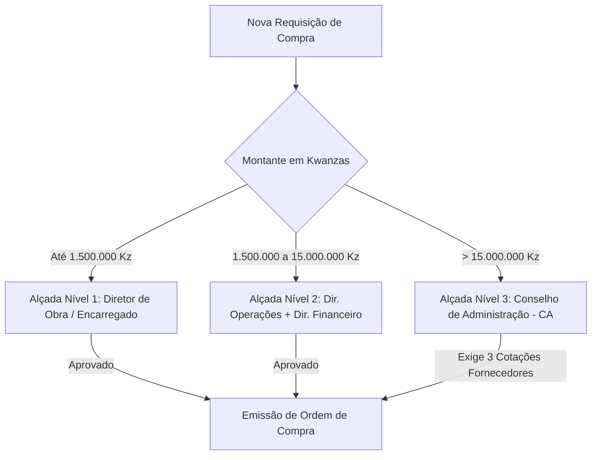

# MANUAL DO UTILIZADOR — PLATAFORMA PROFUNDIDADE OS
## Sistema Operacional Integrado de Gestão de Obras, Infraestruturas, Mineração e Energia

**Versão da Plataforma:** 2.6 Enterprise  
**Edição:** Angola & Mercados Internacionais  
**Moeda Base:** Kwanza Angolano (AOA / Kz)  
**Data da Documentação:** 2026  
**Classificação:** Documento Oficial de Operação & Treinamento

---

# ÍNDICE GERAL

1. [CAPÍTULO 1: INTRODUÇÃO E CONCEITOS FUNDAMENTAIS](#capítulo-1-introdução-e-conceitos-fundamentais)
   - 1.1 O que é a PROFUNDIDADE OS?
   - 1.2 Filosofia Operacional: Da Base de Dados Passiva ao Sistema Dinâmico de Decisão
   - 1.3 Arquitetura de Módulos e Ecossistema Conectado
   - 1.4 Navegadores, Dispositivos e Requisitos de Conectividade
2. [CAPÍTULO 2: ACESSO, REGISTO E GESTÃO DE IDENTIDADE](#capítulo-2-acesso-registo-e-gestão-de-identidade)
   - 2.1 Criação de Conta e Primeiro Acesso (Sign-Up / Login)
   - 2.2 Recuperação e Redefinição de Palavra-Passe
   - 2.3 Perfis de Utilizador, Funções e Matriz de Permissões (RBAC)
   - 2.4 Configuração do Perfil Pessoal e Preferências de Interface (Tema Claro/Escuro)
3. [CAPÍTULO 3: ESTRUTURA ORGANIZACIONAL E DADOS DA EMPRESA](#capítulo-3-estrutura-organizacional-e-dados-da-empresa)
   - 3.1 Cadastro da Entidade / Empreiteiro / Concessionária
   - 3.2 Gestão de Sedes, Estaleiros Centrais e Frentes Operacionais
   - 3.3 Gestão de Clientes, Promotores e Fiscalizações Residentes
4. [CAPÍTULO 4: GESTÃO DE PROJETOS E CONTRATOS (DASHBOARD GERAL)](#capítulo-4-gestão-de-projetos-e-contratos-dashboard-geral)
   - 4.1 Criação de Novo Projeto (Campos Obrigatórios, Tipologias e Orçamento Base)
   - 4.2 Tipologias Especializadas: Construção Civil, Vias & Estradas, Mineração, Energia e Telecomunicações
   - 4.3 Consulta, Filtros, Pesquisa e Ordenação de Projetos
   - 4.4 Arquivamento, Encerramento e Eliminação de Projetos
5. [CAPÍTULO 5: PLANEAMENTO, EAP E CRONOGRAMAS](#capítulo-5-planeamento-eap-e-cronogramas)
   - 5.1 Estrutura Analítica do Projeto (EAP / WBS): Hierarquia de Fases e Atividades
   - 5.2 Parametrização de Custos Previstos, Datas e Durações
   - 5.3 Cronograma de Barras e Diagrama de Gantt
   - 5.4 Dependências entre Tarefas e Rastreio do Caminho Crítico (CPM)
   - 5.5 Matriz de Requisitos e Análise de Capacidade Operacional
6. [CAPÍTULO 6: ORÇAMENTAÇÃO, FINANÇAS E MEDIÇÕES CONTRATUAIS](#capítulo-6-orçamentação-finanças-e-medições-contratuais)
   - 6.1 Lançamento de Transações Financeiras (Receitas vs. Despesas)
   - 6.2 Vinculação de Faturas e Despesas a Nós da EAP
   - 6.3 Composições de Preços Unitários (CPUs) e Análise de Desvios
   - 6.4 Elaboração de Autos de Medição Mensais
   - 6.5 Regras de Retenção de Garantia Contratual e Emissão de Certificados
7. [CAPÍTULO 7: GESTÃO DE RECURSOS, SUPRIMENTOS E COMPRAS](#capítulo-7-gestão-de-recursos-suprimentos-e-compras)
   - 7.1 Cadastro e Gestão de Mão de Obra (Trabalhadores, Categorias e Assiduidade)
   - 7.2 Cadastro de Catálogo de Materiais e Inventário de Armazém
   - 7.3 Requisições de Compra e Esteira de Aprovação por Alçadas (1.5M Kz, 15M Kz, CA)
   - 7.4 Gestão de Fornecedores e Mapas Comparativos de Cotações
   - 7.5 Ponto de Encomenda Inteligente e Alertas de Rutura de Stock
8. [CAPÍTULO 8: DIÁRIO DE OBRA E EXECUÇÃO DE CAMPO (RDO)](#capítulo-8-diário-de-obra-e-execução-de-campo-rdo)
   - 8.1 Registo do Diário de Obras: Clima, Efetivo em Campo e Frentes Ativas
   - 8.2 Apontamento de Equipamentos Trabalhados vs. Parados
   - 8.3 Inclusão de Ocorrências Relevantes, Visitas de Fiscalização e Acidentes
   - 8.4 Dossiê Fotográfico Georreferenciado
   - 8.5 Trancamento Probatório Criptográfico SHA-256 e Validade Jurídica
9. [CAPÍTULO 9: GESTÃO DE FROTAS E EQUIPAMENTOS PESADOS](#capítulo-9-gestão-de-frotas-e-equipamentos-pesados)
   - 9.1 Cadastro da Frota: Próprios vs. Alugados e Custos Horários
   - 9.2 Lançamento de Horímetros e Consumo de Combustível (Litros de Gasóleo)
   - 9.3 Planos de Manutenção Preventiva (Ciclos de 250h, 500h, 1000h)
   - 9.4 Deteção de Anomalias de Consumo e Prevenção de Fugas/Furtos
10. [CAPÍTULO 10: ENGENHARIA CIVIL E CONTROLO TÉCNICO ESTRUTURAL](#capítulo-10-engenharia-civil-e-controlo-técnico-estrutural)
    - 10.1 Módulo de Betonagem: Guia de Betonagem, Rastreabilidade de Cubos e Ensaios 7/28 Dias
    - 10.2 Inspeção de Armaduras (Varões CA-50, Espaçadores e Recobrimentos)
    - 10.3 Controlo de Cofragens e Prazos de Descofragem
    - 10.4 Gestão e Avaliação de Subempreiteiros Especializados
11. [CAPÍTULO 11: MÓDULO ESPECIALIZADO DE VIAS, ESTRADAS E INFRAESTRUTURAS](#capítulo-11-módulo-especializado-de-vias-estradas-e-infraestruturas)
    - 11.1 Cálculos Topográficos: Poligonais e Irradiações
    - 11.2 Modelação Digital de Terreno (MDT) e Curvas de Nível
    - 11.3 Perfis Longitudinais e Transversais
    - 11.4 Cálculo de Volumes de Terraplanagem (Corte, Aterro, Bota-Fora e Jazidas)
    - 11.5 Controlo Linear de Avanço por Estacas (PKs)
12. [CAPÍTULO 12: MÓDULO ESPECIALIZADO DE MINERAÇÃO](#capítulo-12-módulo-especializado-de-mineração)
    - 12.1 Controlo de Produção por Turno (Toneladas Extraídas, ROM e Estéril)
    - 12.2 Gestão de Teores e Curva de Rendimento
    - 12.3 Gestão de Títulos Mineiros, Concessões e Licenças MIREMPET
    - 12.4 Análise de Produtividade Unitária (Custo por Tonelada Movimentada)
    - 12.5 Rastreabilidade de Lotes e Certificação do Processo de Kimberley
13. [CAPÍTULO 13: MÓDULO ESPECIALIZADO DE ENERGIA](#capítulo-13-módulo-especializado-de-energia)
    - 13.1 Registo de Produção Energética (kWh / MWh) por Fonte (Solar, Hídrica, Térmica, Eólica)
    - 13.2 Monitorização de Horas de Operação e Taxa de Disponibilidade
    - 13.3 Rácio de Eficiência Operacional (kWh por Hora de Operação)
    - 13.4 Lançamento Automático de Custos de O&M (Operação e Manutenção)
14. [CAPÍTULO 14: MÓDULO ESPECIALIZADO DE TELECOMUNICAÇÕES](#capítulo-14-módulo-especializado-de-telecomunicações)
    - 14.1 Cadastro e Gestão de Sites (Torres Greenfield, Rooftop e Small Cells)
    - 14.2 Ciclo de Vida do Site: Do Planeamento ao Site Ativo / Radiante
    - 14.3 Georreferenciação, Coordenadas GPS e Altura de Torres
    - 14.4 Associação de Equipamentos Ativos e Passivos por Bastidor
15. [CAPÍTULO 15: HSEQ, QUALIDADE, SEGURANÇA E AMBIENTE](#capítulo-15-hseq-qualidade-segurança-e-ambiente)
    - 15.1 Fichas de Verificação de Serviço (FVS) e Checklists Digitais
    - 15.2 Registo e Investigação de Incidentes, Quase-Acidentes e Dias Sem Acidentes
    - 15.3 Matriz de Avaliação de Riscos Operacionais (Probabilidade vs. Impacto)
    - 15.4 Plano de Preparação e Garantia de Qualidade (PPAQ)
16. [CAPÍTULO 16: GESTÃO DOCUMENTAL E ENGENHARIA DIGITAL (BIM / RFI)](#capítulo-16-gestão-documental-e-engenharia-digital-bim--rfi)
    - 16.1 Repositório Central de Ficheiros, Desenhos e Peças Escritas
    - 16.2 Visualizador de Modelos 3D e Telas Finais
    - 16.3 Anotações Tridimensionais e Coordenadas Espaciais
    - 16.4 Gestão de Pedidos de Informação Técnica (RFI) e Mudanças de Projeto
17. [CAPÍTULO 17: ANÁLISE DE VALOR AGREGADO (EVA / EARNED VALUE)](#capítulo-17-análise-de-valor-agregado-eva--earned-value)
    - 17.1 Conceito e Metodologia de EVA no Profundidade
    - 17.2 O Valor Previsto (PV - Planned Value)
    - 17.3 O Valor Ganho (EV - Earned Value)
    - 17.4 O Custo Real (AC - Actual Cost)
    - 17.5 Índices de Desempenho: CPI (Custo) e SPI (Prazo)
    - 17.6 Previsões Matemáticas: EAC (Estimate at Completion), ETC e VAC (Variance at Completion)
    - 17.7 Interpretação Prática dos Cenários EVA para Engenheiros e Diretores
18. [CAPÍTULO 18: OS 5 MOTORES INTELIGENTES DE DECISÃO EM TEMPO REAL](#capítulo-18-os-5-motores-inteligentes-de-decisão-em-tempo-real)
    - 18.1 Motor 1: Alertas Preditivos & Gestão de Anomalias (Early Warning Engine)
    - 18.2 Motor 2: Automação de Fluxos & Blindagem Contratual (Workflow & Governance Engine)
    - 18.3 Motor 3: Simulação de Cenários & Engenharia de Valor (What-If Engine)
    - 18.4 Motor 4: Compilador de Cadernos & Dossiês Executivos (Document Automation Engine)
    - 18.5 Motor 5: Extranet Segura para Fiscalização, Fornecedores e Investidores
19. [CAPÍTULO 19: CASOS DE USO COMPLETOS DE PONTA A PONTA](#capítulo-19-casos-de-uso-completos-de-ponta-a-ponta)
    - 19.1 Caso de Uso 1: Construção de Edifício Residencial de 8 Pisos
    - 19.2 Caso de Uso 2: Reabilitação Rodoviária de 45 km em Angola
    - 19.3 Caso de Uso 3: Operação de Concessão de Mineração Aluvionar
20. [CAPÍTULO 20: RESOLUÇÃO DE PROBLEMAS, BOAS PRÁTICAS E ERROS COMUNS](#capítulo-20-resolução-de-problemas-boas-práticas-e-erros-comuns)
    - 20.1 Diagnóstico de Erros de Submissão e Bloqueios de Governação
    - 20.2 Boas Práticas para Diretores de Obra, Fiscais e Encarregados
21. [CAPÍTULO 21: PERGUNTAS FREQUENTES (FAQ)](#capítulo-21-perguntas-frequentes-faq)
22. [CAPÍTULO 22: GLOSSÁRIO TÉCNICO DE ENGENHARIA E SISTEMA](#capítulo-22-glossário-técnico-de-engenharia-e-sistema)

---

# CAPÍTULO 1: INTRODUÇÃO E CONCEITOS FUNDAMENTAIS

## 1.1 O que é a PROFUNDIDADE OS?
A **PROFUNDIDADE OS** é a plataforma tecnológica de gestão de operações de engenharia, construção pesada, infraestruturas de transportes, concessões mineiras, explorações energéticas e redes de telecomunicações líder no mercado angolano e adaptada a ambientes desafiadores.

Desenvolvida com tecnologias de topo (Next.js 15, React 19, Tailwind CSS, TypeScript e Firebase Cloud Services), a plataforma unifica no mesmo ecossistema:
- **Operações de Estaleiro e Campo**: Diários de obra, ensaios de betão, topografia linear, horímetros e abastecimentos de frotas.
- **Engenharia Financeira & Contratos**: Estruturas analíticas de projeto (EAP), orçamentação por CPU, medições auditáveis e cálculo de valor agregado (EVA).
- **Governação & Integridade Legal**: Criptografia de integridade SHA-256 para prevenir fraudes retroativas em litígios e esteiras multinível de aprovação de compras.
- **Portais Colaborativos**: Acessos temporários sem palavra-passe para que Fiscais e Fornecedores interajam com o sistema sem ruído de correio eletrónico.

## 1.2 Filosofia Operacional: Da Base de Dados Passiva ao Sistema Dinâmico de Decisão
Muitos sistemas ERP convencionais comportam-se como **repositórios passivos**: esperam que o utilizador insira dados e apenas mostram desvios quando alguém executa um relatório manual no fim do mês — quando o prejuízo financeiro já ocorreu.

A **PROFUNDIDADE OS** baseia-se num paradigma proativo de **5 Motores Inteligentes**:
1. **Deteção Ativa**: Cruza automaticamente horas trabalhadas de máquinas com combustível gasto. Se houver desvio superior a 25% face à média da frota, dispara um alerta instantâneo de suspeita de fuga ou desvio.
2. **Prevenção de Atrasos em Cadeia**: Se uma tarefa crítica na EAP atrasa 4 dias, calcula em tempo real o impacto nas tarefas sucessoras e alerta a direção antes que o prazo final do contrato expire.
3. **Bloqueio Criptográfico Preventivo**: Autos de medição não podem ser faturados sem fotografias georreferenciadas e ensaios laboratoriais anexados.
4. **Simulações de Resiliência Cambial**: Em cenários de desvalorização do Kwanza (AOA) ou aumentos de preço do gasóleo, simula o impacto nas margens e gera peças de revisão de preços ao abrigo da legislação angolana.

## 1.3 Arquitetura de Módulos e Ecossistema Conectado
A plataforma está estruturada em 4 pilares:
- **Nível 1 — Estrutura e Planeamento**: Gestão de Projetos, EAP (WBS), Cronogramas Gantt, Requisitos e Capacidade.
- **Nível 2 — Recursos e Logística**: Frotas, Equipamentos, Horímetros, Mão de Obra, Compras e Stocks com Ponto de Encomenda Preditivo.
- **Nível 3 — Execução Técnica Especializada**: Vias & Estradas (MDT/Estacas), Mineração (ROM/Kimberley), Energia (kWh/h), Telecomunicações (Sites/Torres), Betonagem, Armaduras e Cofragens.
- **Nível 4 — Governação e Inteligência**: Diário de Obra SHA-256, HSEQ, Contratos, EVA, Motores What-If e Extranet de Parceiros.

## 1.4 Navegadores, Dispositivos e Requisitos de Conectividade
- **Navegadores Homologados**: Google Chrome (v110+), Microsoft Edge (v110+), Mozilla Firefox (v115+), Apple Safari (v16+).
- **Dispositivos Móveis**: Compatibilidade total com smartphones e tablets Android e iOS via design responsivo otimizado para operação no terreno em tablets industriais.
- **Modo de Conexão**: Otimizado para operadoras angolanas (Unitel, Africell, Movicel) e conexões satélite com mecanismos de cache local e compressão de imagens de obra.

---

# CAPÍTULO 2: ACESSO, REGISTO E GESTÃO DE IDENTIDADE

## 2.1 Criação de Conta e Primeiro Acesso (Sign-Up / Login)
Para iniciar sessão na plataforma:
1. Abra o navegador e aceda ao endereço: `https://profundidade.ao/login` (ou ao endereço disponibilizado pelo administrador da sua empresa).
2. Se ainda não possui conta e a sua organização permite autoregisto de colaboradores:
   - Clique em **"Criar Nova Conta"** (`/signup`).
   - Introduza o seu **Nome Completo**, **E-mail Corporativo** (ex: `engenheiro@suaempresa.ao`), **Palavra-passe** (mínimo de 8 caracteres, contendo pelo menos uma maiúscula e um algarismo) e **Cargo/Função**.
   - Clique em **"Registar Conta"**.
3. Se a sua empresa utiliza convites centralizados:
   - Receberá um e-mail de boas-vindas com um link de ativação seguro.
   - Clique no link, defina a sua palavra-passe de acesso e confirme.

## 2.2 Recuperação e Redefinição de Palavra-Passe
Caso se tenha esquecido da palavra-passe:
1. Na página de login, clique no link **"Esqueceu-se da palavra-passe?"**.
2. Introduza o e-mail cadastrado e prima **"Enviar Instruções de Recuperação"**.
3. Verifique a sua caixa de entrada (e a pasta de correio não solicitado/spam).
4. Abra a mensagem oficial da Profundidade e clique no link de segurança com validade de 60 minutos.
5. Digite a nova palavra-passe duas vezes e confirme.

## 2.3 Perfis de Utilizador, Funções e Matriz de Permissões (RBAC)
A PROFUNDIDADE OS utiliza uma matriz rigorosa de controlo de acessos por função (Role-Based Access Control - RBAC):

| Perfil / Função | Permissão de Criação / Edição | Acesso Financeiro / Alçadas | Diário de Obra e FVS | Extranet e Relatórios |
| :--- | :--- | :--- | :--- | :--- |
| **Gestor / Diretor Geral** | Completa em todos os módulos e projetos | Alçada N3 (> 15M Kz) e Aprovação Máxima | Total e Fecho SHA-256 | Acesso Total a Dossiês e Criação de Tokens |
| **Editor / Diretor de Obra** | Projetos atribuídos, EAP, Frotas e Recursos | Alçada N2 (até 15M Kz) | Elaboração, Edição e Assinatura | Cadernos de Medição e Relatórios de Obra |
| **Mestre de Obra / Encarregado** | Apontamentos de campo, efetivo e equipamentos | Alçada N1 (até 1.5M Kz) | Preenchimento do RDO e Checklists | Consulta de cronograma operacional |
| **Fiel de Armazém** | Requisições de material, entradas e saídas de stock | Apenas emissão de pedidos de reposição | Leitura de apontamentos | Emissão de guias de saída de material |
| **Visualizador / Fiscal Técnico** | Leitura de medições, ensaios e relatórios | Apenas consulta de autos homologados | Visto de fiscalização e pareceres | Pareceres na Extranet de Fiscalização |
| **Leitor / Auditor** | Estritamente leitura em todos os módulos | Nenhuma permissão de alteração | Consulta de trilhas de auditoria | Exportação de cópias de segurança |

## 2.4 Configuração do Perfil Pessoal e Preferências de Interface
No canto superior direito de qualquer ecrã, clique no avatar do seu utilizador para aceder a **"Meu Perfil"** (`/profile`):
- **Foto de Perfil**: Carregue uma fotografia nítida para identificação nos relatórios de diário de obra e assinaturas.
- **Contacto Telefónico Direto**: Fundamental para alertas críticos via SMS/Push.
- **Alternador de Tema**: Alterne instantaneamente entre o **Modo Claro (Padrão Corporativo)** e o **Modo Escuro (Trabalho de Campo / Noturno)**.

---

# CAPÍTULO 3: ESTRUTURA ORGANIZACIONAL E DADOS DA EMPRESA

## 3.1 Cadastro da Entidade / Empreiteiro / Concessionária
O administrador da organização acede a **Definições da Organização** (`/admin` ou `/settings`):
- **Razão Social e Nome Comercial**: Designação oficial registada na Conservatória e Guichet Único.
- **NIF (Número de Identificação Fiscal)**: Essencial para emissão de faturas e autos de medição em conformidade com a AGT (Administração Geral Tributária).
- **Alvará de Construção Civil / Título Mineiro**: Número do alvará emitido pelo Ministério das Obras Públicas e Urbanismo ou MIREMPET, respetiva classe e validade.
- **Logótipo Oficial**: Ficheiro PNG ou SVG em alta resolução (será incorporado automaticamente nos cabeçalhos de todos os Cadernos de Medição e Dossiês do Conselho de Administração).

## 3.2 Gestão de Sedes, Estaleiros Centrais e Frentes Operacionais
1. No menu principal, selecione **Organização > Estaleiros e Bases**.
2. Clique em **"+ Novo Estaleiro"**.
3. Preencha:
   - **Nome**: Ex: *Estaleiro Central Viana* ou *Base Avançada Saurimo*.
   - **Província e Município**: Seleção da província angolana (Luanda, Huambo, Benguela, Lunda Sul, etc.).
   - **Coordenadas Geográficas (Latitude e Longitude)**: Permite o rastreio da frota de camiões e equipamentos que entram ou saem da cerca geográfica (*geofencing*).
   - **Responsável pelo Estaleiro**: Seleção do engenheiro ou fiel de armazém responsável.

---

# CAPÍTULO 4: GESTÃO DE PROJETOS E CONTRATOS (DASHBOARD GERAL)

## 4.1 Criação de Novo Projeto
Para lançar uma nova empreitada ou concessão no sistema:
1. Aceda ao **Dashboard Principal** (`/dashboard`).
2. Clique no botão de destaque azul **"+ Novo Projeto"**.
3. Abre-se o formulário de abertura de projeto:
   - **Nome do Projeto (Obrigatório)**: Nome claro e oficial (ex: *Construção da Ponte sobre o Rio Kwanza - Troço B*).
   - **Tipo de Projeto (Obrigatório)**: Selecione entre *Residencial*, *Edifício*, *Estrada*, *Infraestrutura*, *Mineração*, *Energia*, *Telecomunicações* ou *Outro*. A escolha deste campo molda dinamicamente a estrutura de menus do projeto!
   - **Orçamento Inicial Contratual (Kz / AOA)**: Montante total adjudicado sem IVA.
   - **Data de Início Prevista e Data de Conclusão Contratual**: Estabelecem o horizonte temporal inicial.
   - **Localização / Província**: Coordenadas geográficas ou morada do estaleiro principal.
   - **Nome do Cliente / Dono da Obra**: Ex: *Ministério das Obras Públicas*, *Endiama*, *RNT-EP*, *Unitel*.
   - **E-mail do Cliente**: Permite o envio automático de relatórios ou convites para o Portal da Extranet.
4. Clique em **"Criar Projeto"**. O projeto é inicializado com status `"Planeamento"` e progresso `0%`.

## 4.2 Tipologias Especializadas e Adaptação dos Menus
Quando o projeto é do tipo:
- **"Estrada"**: O menu ativa imediatamente a aba **"Vias & Terraplanagem"** (Topografia, Perfis, Volumes por Estacas e DMT).
- **"Mineração"**: O menu ativa **"Mineração"** (Turnos, Tonelagem ROM, Teores e Rastreabilidade Kimberley).
- **"Energia"**: O menu ativa **"Energia"** (Produção kWh, Horas de Operação, Eficiência kWh/h e O&M).
- **"Telecomunicações"**: O menu ativa **"Sites & Torres"** (Greenfield/Rooftop, Altura, Coordenadas e Equipamentos).
- **"Edifício / Residencial"**: O menu ativa **"Betonagem"**, **"Armaduras"**, **"Cofragens"** e **"Subempreiteiros"**.

---

# CAPÍTULO 5: PLANEAMENTO, EAP E CRONOGRAMAS

## 5.1 Estrutura Analítica do Projeto (EAP / WBS)
A **EAP** (Work Breakdown Structure) é o alicerce de todo o controlo físico e financeiro da PROFUNDIDADE OS.
1. No menu do projeto, clique em **Planeamento > EAP**.
2. Para adicionar uma nova fase principal:
   - Clique em **"+ Adicionar Fase"**.
   - Introduza o código (ex: `01`), o nome (ex: `Trabalhos Preparatórios e Estaleiro`) e o orçamento previsto.
3. Para adicionar subatividades:
   - Clique no botão `+` da fase correspondente.
   - Introduza o código hierárquico (ex: `01.01`), o nome (ex: `Desmatação e Decapagem Mecânica`), a quantidade prevista, a unidade de medida (`m²`, `m³`, `kg`, `un`) e o custo unitário em Kwanzas.
4. O sistema calcula automaticamente o peso percentual de cada item no orçamento global.

## 5.2 Dependências e Rastreio do Caminho Crítico (CPM)
1. Na visualização de EAP ou **Cronograma**, selecione a atividade e clique em **"Editar Dependências"**.
2. Selecione as atividades predecessoras (ex: a tarefa *Betonagem de Laje* depende do término de *Armação de Aço* e *Inspeção de Cofragem*).
3. Defina o tipo de vínculo: `Fim-para-Início (FS)` ou `Início-para-Início (SS)`.
4. O algoritmo de Caminho Crítico calcula a folga total de cada atividade:
   - As atividades com **Folga Zero** são realçadas a vermelho (**Caminho Crítico**).
   - Qualquer dia de atraso nestas tarefas provocará atraso idêntico na conclusão final da obra.

---

# CAPÍTULO 6: ORÇAMENTAÇÃO, FINANÇAS E MEDIÇÕES CONTRATUAIS

## 6.1 Lançamento de Transações Financeiras (Receitas vs. Despesas)
1. Aceda ao separador **Finanças > Financeiro & Faturação**.
2. Para registar uma nova despesa (fatura de fornecedor, subempreiteiro ou combustível):
   - Clique em **"+ Nova Transação"**.
   - Tipo: Selecione **"Despesa"**.
   - Descrição: Ex: *Fatura nº 8821 - Fornecimento de Brita 2*.
   - Montante: Introduza o valor líquido em Kz.
   - Categoria: Selecione entre *Materiais*, *Equipamentos*, *Mão de Obra*, *Subempreiteiros* ou *Indiretos*.
   - **Vínculo à EAP (Crucial)**: Escolha a que atividade da EAP o custo pertence. É esta vinculação que alimenta o cálculo de Valor Ganho (EVA)!
   - Anexe o comprovativo em PDF ou imagem.
3. Para registar um pagamento recebido do Dono da Obra:
   - Tipo: Selecione **"Receita"**.
   - Indique o auto de medição liquidado.

## 6.2 Elaboração e Validação de Autos de Medição
1. No menu, clique em **Engenharia > Autos de Medição** (`/measurement-certificates`).
2. Clique em **"+ Novo Auto de Medição"**.
3. Preencha:
   - Número do Auto: Ex: `Auto nº 04`.
   - Período de Medição: Data de início e fim do mês de apuramento.
   - Tabela de Quantidades: Introduza as quantidades reais medidas no terreno para cada artigo contratual.
   - Percentagem de Retenção de Garantia: Ex: `5%` ou `10%` (calculado e deduzido automaticamente).
4. O sistema executa a **Blindagem de Medição**:
   - Se o auto não tiver fotografias georreferenciadas anexadas, a submissão formal é bloqueada com aviso de governação.
   - Se o valor for superior a 10.000.000 Kz e não houver boletins laboratoriais anexados, é emitido alerta de conformidade.

---

# CAPÍTULO 7: GESTÃO DE RECURSOS, SUPRIMENTOS E COMPRAS

## 7.1 Mão de Obra e Folha de Campo
1. Aceda a **Recursos > Mão de Obra**.
2. Cadastre os colaboradores: Nome, BI/Passaporte, Categoria Profissional (Pedreiro, Topógrafo, Operador de Manobras, Engenheiro Júnior) e Custo Homem-Hora (AOA/h).
3. No final de cada turno, o Encarregado regista a assiduidade diretamente através do Diário de Obras, alocando as horas de cada trabalhador às frentes de trabalho.

## 7.2 Esteira de Aprovação de Compras por Alçadas
Para eliminar compras indevidas e garantir a transparência orçamental, o sistema implementa 3 níveis de aprovação rígidos:



- **Procedimento para Aprovar**: O gestor com alçada acede a **Motores de Decisão > Governação & Alçadas**, revê as cotações anexas e clica em **"Aprovar como Gestor com Alçada"**. O sistema regista o carimbo digital, data/hora e o hash da decisão.

## 7.3 Ponto de Encomenda Inteligente (Smart Stock)
No módulo **Compras & Stocks**, o sistema monitoriza os consumos dos últimos 7 dias:
$$\text{Ponto de Encomenda} = (\text{Taxa Média Diária} \times \text{Lead Time Fornecedor}) + \text{Margem de Contingência}$$
Quando o inventário físico de cimento, gasóleo ou varão de aço desce abaixo deste limite, o sistema gera automaticamente uma notificação de reposição urgente, calculando a quantidade ótima de encomenda.

---

# CAPÍTULO 8: DIÁRIO DE OBRA E EXECUÇÃO DE CAMPO (RDO)

## 8.1 Registo Diário Passo a Passo
1. No menu do projeto, clique em **Execução > Diário de Obras** (`daily-reports`).
2. Clique em **"+ Novo Registo Diário"**.
3. Preencha os dados do turno:
   - **Data**: Data do dia de trabalho.
   - **Condições Atmosféricas**: Selecione Manhã/Tarde (Bom / Chuva Fraca / Chuva Forte que impede trabalhos). O registo de chuva é prova jurídica fundamental para justificação de extensões de prazo contratual!
   - **Efetivo Presente**: Total de técnicos, oficiais e serventes em obra.
   - **Equipamentos em Operação**: Selecione máquinas ativas e avariadas.
   - **Trabalhos Realizados**: Descrição detalhada dos volumes executados (ex: *Concluída betonagem da laje do piso 2 com 42m³ de betão C25/30*).
   - **Ocorrências / Visitas**: Registo de vistorias da fiscalização e anotações do dono da obra.
   - **Dossiê Fotográfico**: Carregue fotografias tiradas no telemóvel ou tablet da obra.

## 8.2 O Trancamento Probatório Criptográfico (SHA-256)
Para garantir que o diário de obra não seja adulterado retroativamente em caso de litígio arbitral ou judicial:
1. No final do turno ou às 23h59, o Diretor de Obra ou Fiscal acede ao diário e clica em **"Trancar Diário de Obra e Gerar Hash SHA-256"**.
2. O sistema gera uma chave criptográfica única e irreversível baseada no conteúdo do texto, nas fotografias e no carimbo temporal.
3. Uma vez gerado o selo, o registo fica **imutável** e exibe o crachá verde de conformidade probatória.

---

# CAPÍTULO 9: GESTÃO DE FROTAS E EQUIPAMENTOS PESADOS

## 9.1 Cadastro e Acompanhamento Horímetro
1. Aceda a **Recursos > Equipamentos**.
2. Clique em **"+ Novo Equipamento"**:
   - Nome: Ex: *Escavadora de Rastos Caterpillar 336D*.
   - Categoria: Veículo Pesado, Veículo Leve, Grupo Gerador, Central de Britagem.
   - Propriedade: Próprio ou Alugado (indicando taxa diária/mensal).
   - Custo Operacional Homem/Máquina estimado por hora.
   - Horímetro Inicial: Leitura do contador do motor.

## 9.2 Deteção de Anomalias no Consumo de Combustível
1. Diariamente, ao registar o abastecimento de gasóleo e a leitura do horímetro:
   - Se uma escavadora consumiu 35 litros por hora e o benchmark da frota é de 26 litros/hora (+34% de desvio), o **Motor Early Warning** gera um alerta imediato.
   - O gestor pode classificar a ocorrência como: *Possível Fuga*, *Suspeita de Furto/Desvio* ou *Injeção Descalibrada*.

---

# CAPÍTULO 10: ENGENHARIA CIVIL E CONTROLO TÉCNICO ESTRUTURAL

## 10.1 Guia e Controlo de Betonagem
1. Aceda a **Engenharia > Betonagem & Betão** (`concrete-pour`).
2. Registe cada betonagem:
   - Peça estrutural (Sapata S1 a S6, Pilares Piso 1, Viga V102).
   - Volume previsto vs. volume entregue em obra.
   - Central fornecedora e número da guia de remessa.
   - Ensaio de Abaixamento de Cone (*Slump Test*) medido no estaleiro em milímetros (ex: 120 mm).
   - Registo de marcação de cubos para esmagamento laboratorial aos 7 e aos 28 dias.
3. Ao atingir os 28 dias, o sistema notifica o responsável para anexar o relatório de resistência à compressão (MPa).

---

# CAPÍTULO 11: MÓDULO ESPECIALIZADO DE VIAS, ESTRADAS E INFRAESTRUTURAS

## 11.1 Topografia Linear e MDT
1. No menu do projeto, aceda a **Vias & Terraplanagem** (`estrada`).
2. Importe o ficheiro de pontos topográficos (formato CSV ou TXT contendo `Ponto, X, Y, Z, Código`).
3. O sistema calcula a triangulação do **MDT (Modelação Digital do Terreno)** e gera curvas de nível em intervalos de 1m ou 5m.

## 11.2 Volumes de Terraplanagem e Otimização de DMT
1. Defina a rasante do projeto linear.
2. O sistema gera automaticamente os perfis transversais estaca a estaca (a cada 20 metros).
3. O algoritmo calcula o volume de **Corte** e o volume de **Aterro**:
   - Identifica o balanço de massas.
   - Calcula a **Distância Média de Transporte (DMT)** entre frentes de escavação e aterro, minimizando o percurso dos camiões basculantes e reduzindo em até 23% o consumo de gasóleo da operação de terraplanagem.

---

# CAPÍTULO 12: MÓDULO ESPECIALIZADO DE MINERAÇÃO

## 12.1 Controlo de Produção e Teores
1. No menu, clique em **Mineração > Dashboard & Produção**.
2. Registe os dados do turno de lavra:
   - Toneladas de estéril movimentadas (Decapagem).
   - Toneladas de minério útil (ROM - Run of Mine) alimentadas à fábrica de tratamento.
   - Volume de água e reagentes consumidos.
   - Teor recuperado (ex: quilates por 100 toneladas em diamantes, gramas por tonelada em ouro).
3. O sistema calcula instantaneamente o rácio estéril/minério e o custo direto de produção por tonelada.

## 12.2 Rastreabilidade Kimberley e Títulos Mineiros
- No separador **Concessões & Kimberley**, cada lote de minério produzido recebe um código alfanumérico com selo digital, permitindo anexar certificados de pesagem, lacragem de cofres e exportação oficial em total conformidade com o MIREMPET e o Processo de Kimberley.

---

# CAPÍTULO 13: MÓDULO ESPECIALIZADO DE ENERGIA

## 13.1 Registo de Produção (kWh / MWh)
1. Aceda a **Operação > Produção & Eficiência** (`energia`).
2. Lance as leituras dos contadores de injeção na rede (RNT/ENDE) ou grupos geradores industriais.
3. O sistema calcula:
   - Horas equivalentes de operação no período.
   - Horas de indisponibilidade por avaria ou manutenção programada.
   - Rácio de eficiência ($\text{kWh} / \text{hora de operação}$).
   - Emissões de $CO_2$ evitadas no caso de instalações solares fotovoltaicas.

---

# CAPÍTULO 14: MÓDULO ESPECIALIZADO DE TELECOMUNICAÇÕES

## 14.1 Gestão de Sites e Torres de Comunicação
1. Aceda a **Telecomunicações > Sites**.
2. Clique em **"+ Novo Site"**:
   - Código do Site: Ex: `LDA-0412-GF`.
   - Tipo de Estrutura: *Torre Auto-portante*, *Estaiada*, *Monopolo* ou *Rooftop*.
   - Coordenadas de Georreferenciação e Cota do Terreno.
   - Altura da Torre (metros).
   - Equipamentos instalados: Rádios, Antenas Setoriais, Banco de Baterias e Gerador de Apoio.

---

# CAPÍTULO 15: HSEQ, QUALIDADE, SEGURANÇA E AMBIENTE

## 15.1 Checklists Digitais e FVS
1. Aceda a **Pós-Obra > Checklists (FVS)** (`fvs-checklists`).
2. Selecione a Ficha de Verificação de Serviço correspondente (ex: *FVS - Armaduras de Pilares*, *FVS - Assentamento de Camada de Base em Brita Graduada*).
3. Para cada item da inspeção, assinale: `Conforme`, `Não Conforme` ou `Não Aplicável`.
4. Em caso de não-conformidade, anexe fotografia do defeito e defina prazo para ação corretiva.

## 15.2 Registo de Incidentes de Segurança
1. Aceda a **Controlo > HSEQ**.
2. Clique em **"+ Registar Incidente"**:
   - Classificação: Quase-Acidente (*Near Miss*), Acidente com Primeiros Socorros, Acidente com Baixa Médica (*LTI*), Incidente Ambiental.
   - Descrição sumária e identificação dos colaboradores envolvidos.
   - Matriz de Risco: Probabilidade (1 a 5) versus Impacto (1 a 5).
   - Plano de mitigação imediato e medidas de prevenção de recorrência.
3. O dashboard do projeto atualiza em tempo real o contador de **"Dias Consecutivos Sem Acidentes com Baixa"**.

---

# CAPÍTULO 16: GESTÃO DOCUMENTAL E ENGENHARIA DIGITAL (BIM / RFI)

## 16.1 Telas Finais, Desenhos e Modelos 3D
1. Aceda a **Engenharia > BIM / Docs / Peças / RFI**.
2. Faça o carregamento de peças desenhadas em formato PDF, DWG ou modelos tridimensionais em formato IFC/OBJ.
3. O visualizador integrado da PROFUNDIDADE OS permite:
   - Navegar na geometria do projeto sem necessidade de software CAD instalado na máquina.
   - Criar anotações técnicas e notas de não-conformidade diretamente nas coordenadas 3D do modelo, notificando o projetista responsável.

---

# CAPÍTULO 17: ANÁLISE DE VALOR AGREGADO (EVA / EARNED VALUE)

A PROFUNDIDADE OS implementa a metodologia internacional de **Earned Value Management (EVM)** de forma totalmente automatizada através dos dados inseridos na EAP e nas finanças.

## 17.1 Os Três Pilares Matemáticos
1. **Planned Value ($PV$) — Valor Previsto**:
   $$PV = \text{Orçamento Total} \times \% \text{ de Avanço Físico Planeado}$$
   Representa o valor do trabalho que deveria ter sido concluído até à data atual segundo o cronograma contratual.

2. **Earned Value ($EV$) — Valor Ganho**:
   $$EV = \text{Orçamento Total} \times \% \text{ de Avanço Físico Real Executado}$$
   Representa o valor orçamentado do trabalho efetivamente entregue no terreno e validado pelas medições.

3. **Actual Cost ($AC$) — Custo Real**:
   $$AC = \text{Soma de todas as despesas reais acumuladas faturadas na obra}$$

## 17.2 Índices de Desempenho e Diagnóstico
- **Índice de Desempenho de Custos ($CPI$)**:
  $$CPI = \frac{EV}{AC}$$
  - $CPI > 1.0$: A obra está a custar **menos** do que o previsto (lucro superior).
  - $CPI < 1.0$: A obra está com **sobrecusto** orçamental.
- **Índice de Desempenho de Prazos ($SPI$)**:
  $$SPI = \frac{EV}{PV}$$
  - $SPI > 1.0$: A obra está **adiantada** no cronograma.
  - $SPI < 1.0$: A obra está **atrasada**.

## 17.3 Previsões de Término
- **Estimate at Completion ($EAC$)**: Estimativa de custo total final da obra ao ritmo operacional atual:
  $$EAC = \frac{\text{Orçamento Total Contratual}}{CPI}$$
- **Variance at Completion ($VAC$)**: Variação final no término:
  $$VAC = \text{Orçamento Total} - EAC$$

---

# CAPÍTULO 18: OS 5 MOTORES INTELIGENTES DE DECISÃO EM TEMPO REAL

Para aceder ao orquestrador central de inteligência, clique em **Motores de Decisão (IA & Tempo Real)** na barra de navegação do projeto.

```
+---------------------------------------------------------------------------------------------------+
|                           MOTORES INTELIGENTES PROFUNDIDADE OS                                     |
|                                                                                                   |
| [1. Alertas & Anomalias] [2. Governação & Alçadas] [3. Simulação What-If] [4. Cadernos] [5. Extranet] |
+---------------------------------------------------------------------------------------------------+
```

## 18.1 Motor 1: Alertas Preditivos & Gestão de Anomalias (Early Warning)
- Monitoriza 24 horas por dia desvios de consumo da frota, atrasos de tarefas do caminho crítico que impactam o encerramento do contrato e prazos de licenças/seguros a menos de 30 dias de expiração.
- Fornece diagnósticos automáticos de causa raiz e planos de mitigação sugeridos.

## 18.2 Motor 2: Governação e Blindagem Contratual (Workflow)
- Visualização de todas as requisições de compra em trânsito por alçada.
- Terminal interativo para **fecho de turno probatório com selo criptográfico SHA-256**.
- Painel de auditoria de evidências obrigatórias para submissão de autos de medição.
- Lista de materiais em ponto crítico de reposição logística.

## 18.3 Motor 3: Simulação What-If & Engenharia de Valor
- **Sliders de Stress Macroeconómico**: Arraste os controles de variação de Gasóleo (+%), Câmbio USD/AOA, Cimento e Aço para observar o recálculo instantâneo do EAC, da margem contratual e das composições CPU afetadas.
- **Otimizador de DMT**: Apresenta a matriz de terraplanagem minimizando o frete de camiões.
- **Crash Scheduling**: Compara o custo financeiro de adicionar turnos de trabalho contra o valor de multas de mora contratuais evitadas.

## 18.4 Motor 4: Cadernos & Dossiês Executivos em 1 Clique
- **Caderno de Medição Oficial**: Capa, resumo executivo, medição detalhada por artigos, mapa fotográfico georreferenciado e bloco de assinaturas pronto para impressão ou exportação em PDF (`Ctrl+P` / `Cmd+P`).
- **Dossiê do Conselho de Administração (Board Pack)**: Análise executiva de Valor Ganho (EVA), gráficos de Curva S e matriz de riscos estratégicos.
- **Livro Digital da Obra (As-Built Handover)**: Compilação integral em 5 capítulos para encerramento contratual e entrega formal ao Dono da Obra.

## 18.5 Motor 5: Extranet Segura
- Permite emitir links temporários de **7 dias com token criptográfico sem necessidade de conta ou palavra-passe**.
- Perfis suportados:
  1. **Fornecedor**: submissão de cotação comercial com prazo de entrega no estaleiro.
  2. **Fiscalização Residente**: visto técnico e parecer formal sobre autos de medição.
  3. **Investidor / Dono da Obra**: painel de acompanhamento com avanço físico e fotografias.

---

# CAPÍTULO 19: CASOS DE USO COMPLETOS DE PONTA A PONTA

## 19.1 Caso de Uso 1: Construção de Edifício Residencial de 8 Pisos
1. O Gestor cria o projeto do tipo *Edifício*, definindo o orçamento base de 450.000.000 Kz.
2. A equipa de planeamento estrutura a EAP em 6 fases: *Fundações*, *Estrutura em Betão Armado*, *Alvenarias*, *Instalações Técnicas*, *Acabamentos* e *Arranjos Exteriores*.
3. O Mestre de Obra preenche diariamente o Diário de Obras, alocando 32 trabalhadores e registando a betonagem das vigas.
4. Para cada betonagem, é aberta uma guia no módulo de Betonagem com o ensaio de *slump* e registo de cubos para ensaio aos 28 dias.
5. No final do mês, o Engenheiro de Custos gera o **Caderno de Medição em 1 clique**, que compila os trabalhos e as fotos das sapatas. O Fiscal acede ao link seguro da Extranet e homologa o auto.
6. A fatura é emitida e o pagamento é liquidado pelo Dono da Obra, atualizando o progresso financeiro e as curvas EVA.

## 19.2 Caso de Uso 2: Reabilitação Rodoviária de 45 km em Angola
1. O Gestor cria o projeto do tipo *Estrada*, indicando a extensão de 45 km.
2. A equipa de topografia descarrega as coordenadas da poligonal e calcula os perfis transversais a cada 20 metros (estacas 0 a 2250).
3. O **Motor de Cenários (DMT)** otimiza o transporte de 120.000 m³ de terraplanagem, reduzindo o custo de frete dos camiões basculantes em 14.500.000 Kz.
4. As escavadoras e motoniveladoras têm as suas horas registadas; o **Motor Early Warning** deteta que a motoniveladora nº 3 está a consumir 38 L/h (desvio de +31%) e alerta o encarregado mecânico para substituição de bicos injetores.
5. No fim da empreitada, o sistema emite o **Livro Digital da Obra (As-Built Handover)** com todas as telas finais e relatórios Proctor de compactação, formalizando a receção provisória da obra perante o Ministério das Obras Públicas.

---

# CAPÍTULO 20: RESOLUÇÃO DE PROBLEMAS, BOAS PRÁTICAS E ERROS COMUNS

## 20.1 Mensagens de Bloqueio e Soluções Imediatas
- **Erro: "Submissão Bloqueada: Faltam evidências fotográficas ou boletins de ensaio no auto de medição"**:
  - *Causa*: O auto de medição ultrapassa 10M Kz ou não contém fotos anexadas.
  - *Solução*: Aceda ao auto de medição, clique no separador "Fotografias / Ensaios" e carregue pelo menos 3 fotografias de campo georreferenciadas e o boletim laboratorial correspondente.
- **Erro: "Requisição pendente de validação de alçada superior"**:
  - *Causa*: O valor da compra ultrapassa 1.500.000 Kz ou 15.000.000 Kz.
  - *Solução*: A requisição foi encaminhada automaticamente para a caixa de aprovação do Diretor de Operações ou do Conselho de Administração no módulo de Governação.
- **Erro: "Token de Extranet Inválido ou Expirado"**:
  - *Causa*: O link enviado ao fornecedor ou fiscal ultrapassou a validade de 7 dias ou foi revogado.
  - *Solução*: No separador **Motores > Extranet**, gere um novo token para o destinatário em 1 clique.

## 20.2 Boas Práticas Operacionais
- **Trancamento Diário**: Nunca deixe diários de obra em aberto por mais de 24 horas. O selo SHA-256 é a sua proteção jurídica em litígios contratuais.
- **Vinculação à EAP**: Jamais lance uma fatura de despesa em "Finanças" sem associar a uma atividade da EAP. Sem essa associação, a Análise de Valor Ganho (EVA) perde precisão.
- **Controlo de Horímetros**: Tome as leituras de horímetro no arranque e no encerramento de cada turno de máquinas pesadas.

---

# CAPÍTULO 21: PERGUNTAS FREQUENTES (FAQ)

**1. Posso utilizar o Profundidade sem ligação à Internet no estaleiro?**  
Sim. A interface em dispositivos móveis permite preencher dados do turno e capturar fotografias em cache local. Assim que o equipamento recuperar sinal móvel (4G/3G ou Wi-Fi do estaleiro), todos os dados são sincronizados com a nuvem.

**2. Como funciona a assinatura criptográfica SHA-256 do Diário de Obra?**  
Ao trancar o turno, o sistema gera uma assinatura matemática de 256 bits única para aquele conteúdo. Se qualquer pessoa tentar adulterar uma linha de texto ou trocar uma foto no futuro, o hash deixa de bater certo e o sistema denuncia a tentativa de fraude.

**3. O fornecedor precisa de criar conta para enviar cotação?**  
Não. O fornecedor recebe um link temporário exclusivo com token criptográfico de 7 dias, abrindo diretamente um formulário seguro e rápido para preenchimento de preços e prazos.

**4. A plataforma suporta contratos em moeda estrangeira (USD ou EUR)?**  
Sim. Embora a moeda base e legal em Angola seja o Kwanza (AOA), o módulo de Simulação What-If permite indexar composições ao dólar norte-americano (USD) e calcular automaticamente revisões de preço por flutuação cambial.

---

# CAPÍTULO 22: GLOSSÁRIO TÉCNICO DE ENGENHARIA E SISTEMA

- **AC (Actual Cost)**: Custo real efetivamente gasto na execução das atividades.
- **As-Built (Telas Finais)**: Desenhos técnicos e especificações que refletem exatamente como a obra foi construída em campo.
- **CPI (Cost Performance Index)**: Rácio entre Valor Ganho e Custo Real ($EV / AC$). Mede a eficiência financeira da obra.
- **CPM (Critical Path Method)**: Método do Caminho Crítico para identificar as tarefas cujo atraso compromete a data final da obra.
- **CPU (Composição de Preço Unitário)**: Decomposição analítica do custo de um serviço (materiais, equipamentos, mão de obra e encargos).
- **DMT (Distância Média de Transporte)**: Distância média percorrida entre as zonas de corte de terras e os aterros ou bota-foras.
- **EAC (Estimate at Completion)**: Custo total previsto para a conclusão do projeto com base no ritmo de desempenho atual.
- **EAP / WBS**: Estrutura Analítica do Projeto, decomposição hierárquica do escopo em fases e tarefas executáveis.
- **EV (Earned Value)**: Valor orçamentado do trabalho executado até ao momento.
- **FVS (Ficha de Verificação de Serviço)**: Checklist formal de inspeção e aceitação da qualidade de um trabalho em obra.
- **Horímetro**: Instrumento que mede o tempo acumulado de funcionamento do motor de uma máquina ou gerador.
- **MDT (Modelação Digital do Terreno)**: Representação matemática tridimensional da superfície topográfica.
- **Processo de Kimberley**: Sistema internacional de certificação de diamantes brutos que atesta que o lote não financia conflitos armados.
- **PV (Planned Value)**: Valor que estava previsto ser executado até à data atual segundo o cronograma.
- **RDO (Registo Diário de Obra)**: Documento oficial diário que regista o efetivo, máquinas, clima e ocorrências no estaleiro.
- **RFI (Request for Information)**: Pedido formal de esclarecimento técnico enviado pelo empreiteiro ao projetista ou fiscal.
- **ROM (Run of Mine)**: Minério bruto extraído da mina antes de passar por qualquer processo de britagem ou tratamento.
- **Slump Test (Ensaio de Abaixamento de Cone)**: Teste laboratorial rápido executado no estaleiro para medir a consistência e trabalhabilidade do betão fresco.
- **SPI (Schedule Performance Index)**: Rácio entre Valor Ganho e Valor Previsto ($EV / PV$). Mede a velocidade de avanço do cronograma.
- **VAC (Variance at Completion)**: Diferença entre o orçamento total acordado e o custo final projetado ($BAC - EAC$).

---
*PROFUNDIDADE OS — O Sistema Operacional de Decisão para a Engenharia e Ativos em Angola.*
